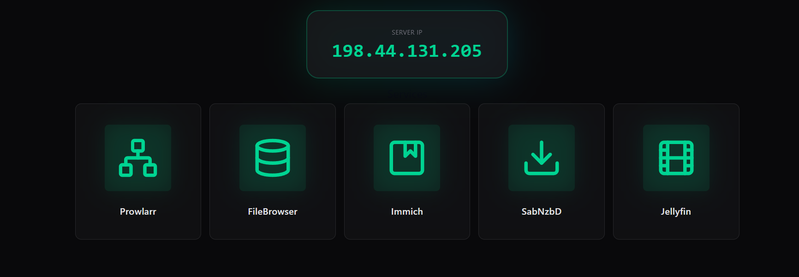
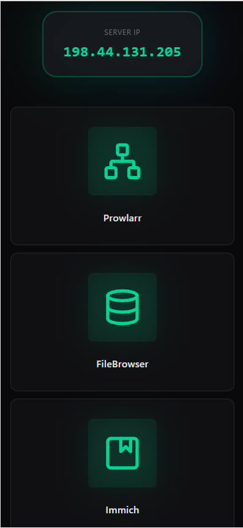

## NAS Dashboard

A modern web dashboard for monitoring Network Added Storage (NAS) services with real-time health checks and status indicators.

# Desktop


### Overview

The NAS Dashboard provides a unified interface to monitor and access all services running on your NAS machine. It displays the server's public IP address and health status for all active services with quick-access links.

### Features

- **Real-time Health Checks**: Monitor the status of all services running on your NAS
- **Service Monitoring**: Track status for the following services:
  - **Jellyfin** - Media server
  - **FileBrowser** - File management interface
  - **SabNzbD** - Usenet downloader
  - **Immich** - Photo management
  - **Prowlarr** - Indexer aggregator

- **Server Information**: Displays your NAS server's public IP address
- **Quick Access**: Direct links to each service's web interface
- **Visual Status Indicators**: Color-coded service status (active/inactive)
- **Responsive Design**: Works seamlessly on desktop and mobile devices

### Tech Stack

**Frontend:**
- React 19
- Vite (build tool)
- Tailwind CSS (styling)
- Lucide React (icons)
- Axios (HTTP client)

**Backend:**
- Node.js / Express 5
- Axios (HTTP requests)
- System `yt-dlp` command for YouTube to MP3 downloads

### Installation & Build

#### Prerequisites
- Node.js (v14 or higher)
- npm
- On Windows, install `yt-dlp` and `ffmpeg` and make sure both commands are available on `PATH`

#### Build Steps

1. **Clone the repository and navigate to the project directory:**
   ```bash
   cd nas-dash
   ```

2. **Install backend dependencies:**
   ```bash
   npm install
   ```

3. **Install frontend dependencies:**
   ```bash
   cd frontend
   npm install
   cd ..
   ```

4. **Build the frontend and deploy:**
   ```bash
   npm run frontend
   ```
   This command will:
   - Build the frontend React app using Vite
   - Move the built files to the `dist` directory
   - Make them accessible by the Express server

5. **Start the server:**
   ```bash
   npm start
   ```
   The dashboard will be available at `http://localhost:3000`

### Development

For frontend development with hot reload:
```bash
cd frontend
npm run dev
```

### Configuration

The backend currently points to a hardcoded NAS IP (`192.168.1.87`). To adjust:
- Edit `app.js` and update the service URLs in the `serviceUrls` object
- Update health check endpoints and API keys as needed
- The default music download directory is `E:/Music/Albums` unless `MUSIC_DIR` is set

### API Endpoints

- `GET /api/health/data` - Get server IP and all services status
- `GET /api/health/filebrowser` - FileBrowser health check proxy
- `POST /api/music/download` - Download YouTube audio as MP3 with `yt-dlp`

### Notes

- The dashboard fetches your public IP from `ipify.org`
- Each service has a configurable health check with a 1-5 second timeout
- All API keys are stored in the backend code (consider using environment variables for production) 
- The Docker image installs `yt-dlp` and `ffmpeg` so `/api/music/download` works inside the container
- `docker-compose.yml` mounts `${MUSIC_SOURCE_DIR:-./music}` into the container at `/data/music` so downloads persist on the host

### Docker

Build and run with Docker Compose:

```bash
docker compose up --build
```

By default, downloads are stored in `./music` next to the compose file.

To use a different host folder, create a `.env` file next to `docker-compose.yml` and set `MUSIC_SOURCE_DIR` for that machine:

```bash
cp .env.example .env
```

Example `.env` values:

```bash
MUSIC_SOURCE_DIR=/mnt/c/Music/Album
```

```bash
MUSIC_SOURCE_DIR=/mnt/d/Music/Album
```

You can also export it in your shell before starting Compose:

```bash
export MUSIC_SOURCE_DIR=/mnt/e/Music/Albums
docker compose up --build
```

On Linux, Docker bind mounts must use Linux paths. A Windows-style path like `E:/Music/Albums` will fail unless that drive is mounted into Linux and referenced by its Linux mount path, such as `/mnt/e/Music/Albums`.

If you run Compose from Windows PowerShell or Command Prompt instead of WSL, use a Windows path such as `E:/Music/Albums` in `.env`.

If you run Compose from WSL, use the Linux mount path such as `/mnt/e/Music/Albums`.

That lets each machine keep its own local `.env` without editing `docker-compose.yml`.

*** Add File: /home/taran/repository/nas-dash/.env.example
MUSIC_SOURCE_DIR=/mnt/c/Music/Album


# Mobile

